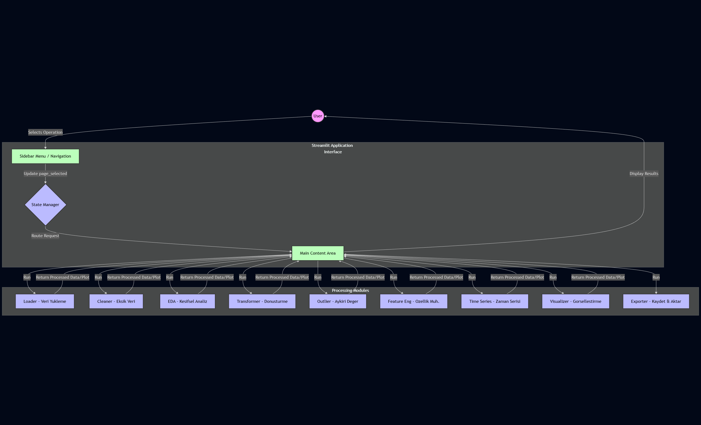

# 🔍 Streamlit Data Manipulation & Analysis Tool

A comprehensive, **No-Code Data Analysis Platform** built with **Python** and **Streamlit**. This application allows users to perform end-to-end data science workflows—from data ingestion and cleaning to advanced feature engineering and time series analysis—through a user-friendly interactive interface.

## 🚀 Key Features

The application is structured into modular components, ensuring scalability and ease of maintenance:

* **📥 Data Ingestion:** Upload CSV, Excel, or JSON files seamlessly.
* **📊 EDA (Exploratory Data Analysis):** Automated summary statistics, correlation matrices, and distribution checks.
* **🧼 Data Cleaning:** Handle missing values (imputation/dropping) and duplicates visually.
* **⚠️ Outlier Detection:** Identify and handle outliers using statistical methods (IQR, Z-Score).
* **✨ Feature Engineering:** Create new variables, scale features (MinMax, Standard), and encode categorical data.
* **⏱️ Time Series Analysis:** Analyze trends, seasonality, and perform decomposition on date-time data.
* **📈 Visualization:** Generate dynamic charts (Line, Bar, Scatter, Heatmap) using Plotly/Matplotlib.
* **💾 Export:** Download the processed and cleaned datasets for external use.

## 🛠️ Tech Stack

* **Frontend & UI:** Streamlit
* **Core Logic:** Python 3.10+
* **Data Manipulation:** Pandas, NumPy
* **Visualization:** Plotly, Matplotlib, Seaborn
* **Statistical Analysis:** Scipy, Statsmodels

## 🏗️ System Architecture

The application uses a modular architecture controlled by a central Session State manager, routing user actions to specific processing modules.



## 📂 Project Structure

```bash
├── main.py              # Application Entry Point & Navigation Logic
├── modules/             # Core Functional Modules
│   ├── loader.py        # Data Import Logic
│   ├── cleaner.py       # Missing Value Handling
│   ├── eda.py           # Exploratory Analysis
│   ├── transformer.py   # Data Transformation
│   ├── time_series.py   # Time Series Logic
│   ├── visualizer.py    # Charting Engine
│   └── ...              # Other helper modules
├── requirements.txt     # Project Dependencies
└── README.md            # Documentation
